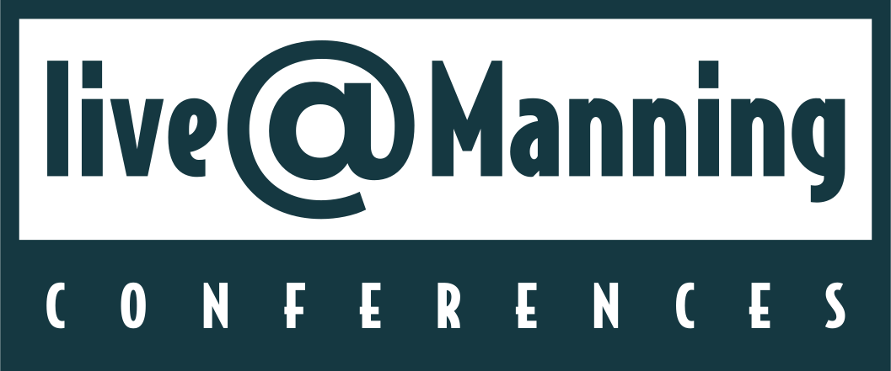

## Talk and demo code for
# `import qsharp` : _Using your Python skills to develop quantum programs_ 
### live@Manning Conference 14 July 2020

> Try running the presentation Jupyter notebook: 
> 
>The video for this presentation can be found on [YouTube](https://youtu.be/nMiSHq_FuT0)

### Want to learn more about Q# and Quantum developement with Python? 
- Check out the book @cgranade and I wrote from Manning: [Learn Quantum Computing With Python and Q#](bit.ly/qsharp-book)
- Watch @crazy4pi314 program live on [Twitch](https://twitch.tv/crazy4pi314) while she works on open source quantum development projects! If you miss the streams you can always catch them on [YouTube](https://youtube.com/SarahKaiser314) after! 💖
